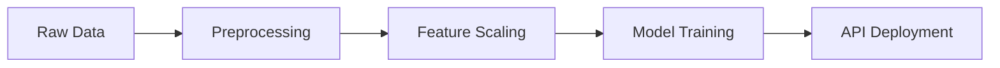

# House-Price-Prediction-Analysis

## Project Overview

A machine learning system that predicts house prices based on property features using multiple regression algorithms. The project includes data preprocessing, model training, hyperparameter optimization, and deployment via FastAPI.

## Business Significance

This system addresses critical needs in:

- **Real Estate Valuation**: Automated price estimation for properties
- **Mortgage Lending**: Risk assessment and property valuation
- **Investment Analysis**: Market trend identification and ROI calculation
- **Home Buying/Selling**: Price benchmarking and negotiation support

## Technical Implementation

### Data Pipeline

### Key Components

**Data Preprocessing**
- Removal of irrelevant columns (ID, Postal Code, Date)
- StandardScaler for numerical feature normalization
- Correlation analysis for feature importance

**Model Development**
- Multiple algorithms tested: Linear Regression, Decision Tree, Random Forest, XGBoost
- Performance metrics: MAE, RMSE, R² Score

**Model Optimization**
- GridSearchCV for hyperparameter tuning
- 5-fold cross-validation
- Parameter space: n_estimators, max_depth, min_samples_split, max_features

**Deployment**
- FastAPI for RESTful API endpoints
- Model serialization using joblib
- Input validation and error handling
- MLflow integration for model tracking

## Technical Stack

- **Data Processing**: Pandas, NumPy
- **Machine Learning**: Scikit-learn, XGBoost
- **Visualization**: Matplotlib, Seaborn
- **API Framework**: FastAPI
- **Model Management**: MLflow, Joblib
- **Server**: Uvicorn

